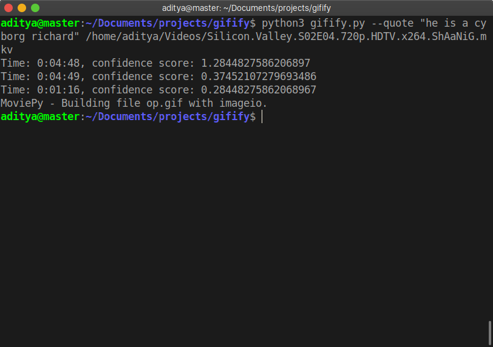
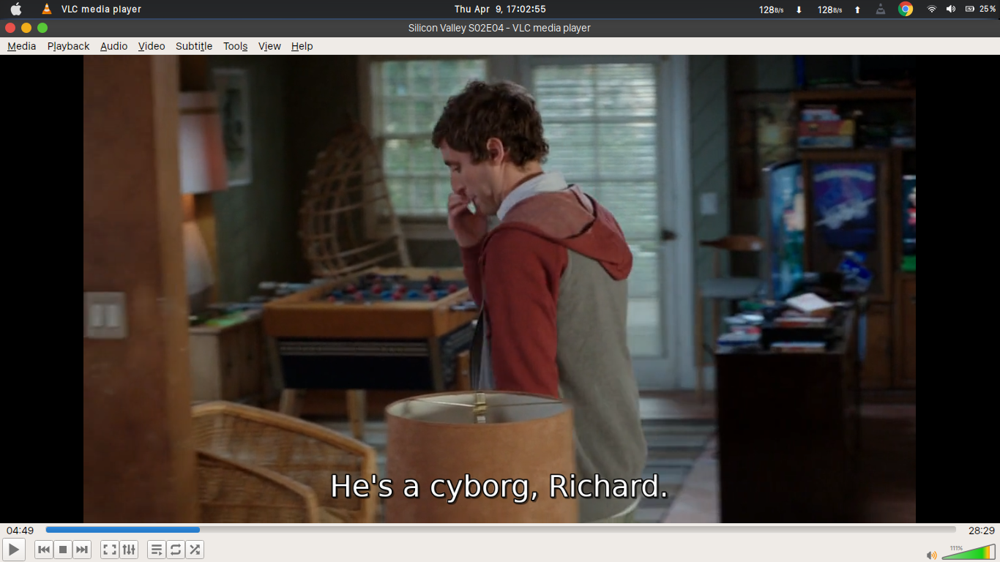

## Gifify

Ever stuck in a situation where you had the perfect quote from your favourite movie for a situation but you couldn't find the gif for it? The next time you find yourself in a similar situation, use this to create a gif in seconds!

### Usage:  

Let the program do the heavy lifting of searching the quote in the movie and creating the gif:
```
python3 gifify.py --quote "Quote here" <Path to video> 
```

Or create the gif between known timestamps:
```
python3 gifify.py --start 01:13 --end 01:15 <Path to video>
```

### Example:

```
 python3 gifify.py --quote "he is a cyborg richard" /home/aditya/Videos/Silicon.Valley.S02E04.720p.HDTV.x264.ShAaNiG.mkv 
```

Output:




Image at `04:48`:

